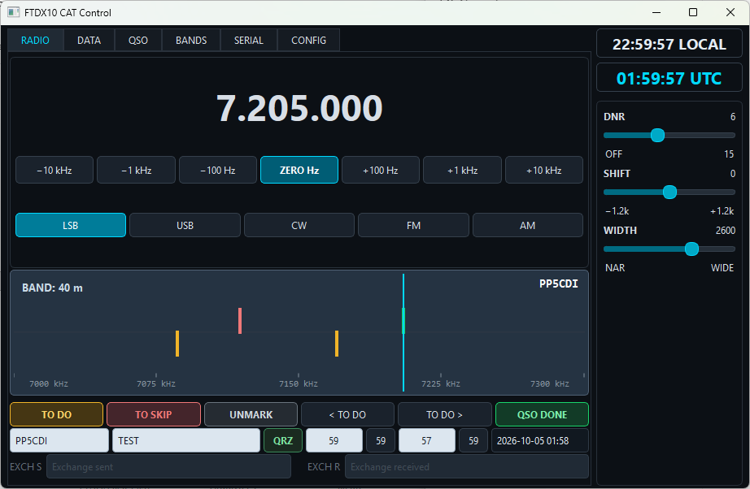

# CAT Control — Yaesu FTDX10

**Find activity. Mark it. Come back instantly.**

CAT Control is a Windows desktop application for amateur radio operators using the **Yaesu FTDX10**. It makes HF band operation faster and more organized: mark interesting frequencies as you tune, keep track of stations you want to work, and return to them quickly without writing frequencies down.

The application communicates directly with the radio through its **USB CAT interface**, combining frequency control, QSO tracking, log exports, and frequently used DSP controls in one compact interface.

**[Download the Windows beta](https://github.com/ngs109/cat-control/releases/download/v0.1.0-beta.3/CAT-Control.zip)** · **[Release notes](https://github.com/ngs109/cat-control/releases/tag/v0.1.0-beta.3)** · **[Project website](https://ngs109.github.io/cat-control/)**

> This is an early beta, so bug reports and suggestions are welcome!

## Screenshot

## Features

### Fast frequency marking and navigation

- Press **MARK** to store the current frequency immediately.
- Continue exploring the band while keeping interesting frequencies available for recall.
- Use the **< / >** navigation controls to move between stored frequencies.
- Associate a **callsign** with a frequency to identify the station.

### QSO status tracking

Press **MARK** to store a frequency you want to revisit. Marked frequencies use **TO DO** as their pending status; **MARK** is the button used for this action.

Keep track of your operating progress:

| Status | Purpose |
| --- | --- |
| **TO DO** | Activity or a station you still want to work. |
| **DONE** | A contact you have completed. |

Mark completed contacts as **QSO DONE** while keeping pending contacts available for later visits.

### Log exports

- **ADIF:** Export completed QSOs for import into QRZ.com and other logging applications that support ADIF.
- **Cabrillo:** Generate a contest log for review and submission.

### Direct radio control

- Monitor **VFO A frequency** in real time.
- Change frequency directly from the application.
- Select **LSB, USB, CW, FM, and AM**.
- Keep frequency and operating information synchronized with the FTDX10.

### DSP controls

Adjust frequently used receiver controls directly from the computer:

| Control | Function |
| --- | --- |
| **DNR** | Digital Noise Reduction. |
| **SHIFT** | Adjust the receiver filter's position. |
| **WIDTH** | Adjust the receiver filter's bandwidth. |

These controls remain accessible while tuning and moving between stations.

## Public Beta

The current public beta is **[v0.1.0-beta.3](https://github.com/ngs109/cat-control/releases/tag/v0.1.0-beta.3)**, published on **October 3, 2026**. This hotfix addresses band-limit settings saving in the Windows executable and reports saving errors visibly.

The first public release, v0.1.0-beta.1, was published on September 30, 2026.

| Item | Details |
| --- | --- |
| Platform | Windows, 64-bit |
| Download | `CAT-Control.zip` |
| Download size | Approximately 45.8 MiB |
| Application | `CAT-Control.exe` |
| Python installation | Not required |
| Target radio | Yaesu FTDX10 |

Download **CAT-Control.zip** from the release assets. GitHub's automatically generated **Source code** archives are repository snapshots, not the Windows application package.

## Requirements

- A **64-bit Windows** computer.
- A **Yaesu FTDX10**.
- A USB cable connecting the radio to the computer.
- The radio's **USB serial driver** installed.
- The correct CAT COM port and serial settings matching the radio.

## Installation

1. Download [CAT-Control.zip](https://github.com/ngs109/cat-control/releases/download/v0.1.0-beta.3/CAT-Control.zip).
2. Extract **CAT-Control.exe** into a writable folder on your computer.
3. When upgrading, replace the executable and keep your existing settings and QSO recovery JSON files beside it.
4. Install the FTDX10 USB serial driver if it is not already installed.
5. Connect the radio to the computer by USB and turn it on.
6. Run **CAT-Control.exe** from the extracted folder.
7. In **SERIAL**, select the radio's CAT COM port and configure settings that match the radio.
8. Check that the displayed frequency follows changes made on the FTDX10.

**No Python installation or companion dependency folder is required.** Do not run the application directly from inside the ZIP archive.

Settings and confirmed QSO recovery files are stored beside the executable. Back up **ftdx10_qso_recovery.json** before moving or replacing the application folder.

## Typical Operating Workflow

1. **Find activity.** Tune across the band using your FTDX10 or the application's frequency controls.
2. **Press MARK.** Store an interesting frequency and continue searching.
3. **Add the callsign.** Associate the station with the frequency when known.
4. **Keep exploring.** Mark other frequencies you want to revisit.
5. **Return quickly.** Use **< / >** to navigate between stored frequencies.
6. **Complete the contact.** Register the completed QSO with **QSO DONE**.
7. **Export your log.** Use ADIF for supported logging services or Cabrillo for contest logging.

Use **DNR, SHIFT, and WIDTH** as needed while listening and working stations.

## Exporting Logs

### ADIF

Generate an ADIF file from your completed QSOs, then import it into **QRZ.com** or another application that supports ADIF.

Check the contact information before export and review the imported records afterward.

### Cabrillo

Generate a Cabrillo file for contest use.

Before submission, review the exported file against the contest's requirements, including station information, categories, and exchange fields. Cabrillo export does not imply automatic compatibility with every contest.

## Beta Limitations

- **Early test release:** Bugs and changes are expected. Features and interface behavior may change in later releases.
- **Radio compatibility:** The documented target is the **Yaesu FTDX10**. Compatibility with other radios is not established.
- **Platform availability:** The published application package is for **Windows 64-bit**. No macOS or Linux application package is currently provided.
- **Export validation:** Review ADIF and Cabrillo output before importing or submitting it, particularly for contest-specific requirements.
- **Documentation scope:** The public repository currently contains the project website, README, and screenshot. Application source code and build instructions are not currently included.

## Troubleshooting

### The application does not start

- Confirm that you extracted the entire ZIP archive.
- The current package contains a single executable; no `_internal` folder is required.
- Run the executable from the extracted folder.

### Settings or band limits are not saved

- Use beta.3 or later.
- Make sure the folder containing CAT-Control.exe allows writing files.
- Click **SAVE BAND LIMITS** after editing the limits in **BANDS**.
- If saving fails, the application displays the settings file path and error, even when DEBUG is disabled.

### The radio does not connect

- Confirm that the FTDX10 is powered on and connected by USB.
- Check that its USB serial driver is installed.
- Verify the assigned COM port in Windows Device Manager.
- Select the radio's CAT port in **SERIAL**.
- Ensure that the application's serial settings match the radio.
- Close other software that may be using the same CAT COM port.

### Frequency information or controls do not update

Check the CAT connection, selected COM port, and serial settings first. If the problem persists, report the steps needed to reproduce it.

## Feedback and Bug Reports

Send bug reports and suggestions to **[nilton.proton@gmail.com](mailto:nilton.proton@gmail.com)**.

Please include:

- CAT Control version.
- Windows version.
- Radio model and CAT settings.
- A clear description of the problem.
- Steps to reproduce it.
- Expected and actual behavior.
- Screenshots or sample export files, when relevant.

Feedback on the MARK button, navigation between marked frequencies, QSO status tracking, DSP controls, and log exports is especially welcome during beta testing.

## Author

Created by **Nilton Schlindwein**.

- GitHub: [ngs109](https://github.com/ngs109)
- Email: [nilton.proton@gmail.com](mailto:nilton.proton@gmail.com)

CAT Control is an **independent amateur radio project**, developed for the Yaesu FTDX10.

## License

No license file is currently included in this repository. Public availability alone does not grant permission to modify or redistribute the software. Contact the author for licensing information.
